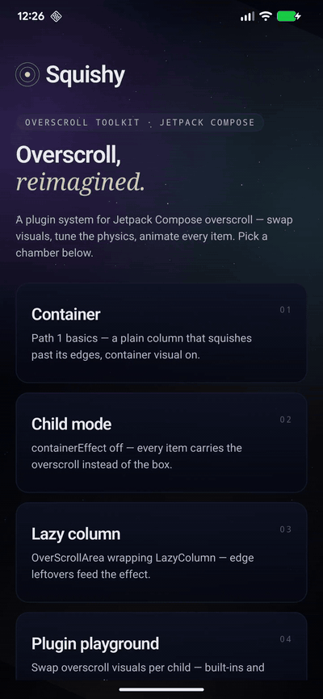

# Squishy

> Plugin-driven overscroll for Jetpack Compose.


[](https://jitpack.io/#/iamjosephmj/Squishy)




One state object drives everything: scroll physics, edge behavior, visual plugins,
and per-item animations — for plain columns, LazyLists, and anything that scrolls.

## Quick start

```kotlin
repositories { maven { setUrl("https://jitpack.io") } }

dependencies { implementation("com.github.iamjosephmj:Squishy:2.1.0") }
```

```kotlin
val state = rememberOverScrollState(
    config = OverScrollConfig(curve = OverscrollCurve.RubberBand()),
)

Column(Modifier.fillMaxSize().overScroll(state)) {
    // content taller than the screen
}
```

Drag past an edge — the container rubber-bands and settles back. Fling into an
edge — leftover velocity becomes a bounce. That's the whole core API.

## The model

Five packages, five responsibilities:

| Package | Owns |
|---|---|
| `…squishy.physics` | The engine (`BaseOverscrollEffect`), drag curves, per-edge config, `OverScrollConfig` |
| `…squishy.scroll` | The scroll pipeline: `Modifier.overScroll`, `OverScrollArea`, the measured layout |
| `…squishy.visual` | The plugin SPI (`OverscrollVisual`), built-ins, `PushDownOverscrollEffect` |
| `…squishy.child` | Per-item DSL (`childOverScrollSupport`) and tag roles (`overscrollRole`) |
| `…squishy.state` | `OverScrollState` and its `remember` factories |

## Recipes

### Bounce the whole container

`overScroll` is one scrollable that owns both scrolling and the effect — the
platform stretch never fights you.

```kotlin
Column(Modifier.overScroll(state)) { /* rows */ }
```

### Items instead of the box

Suppress the container visual; every child carries the overscroll:

```kotlin
Column(Modifier.overScroll(state, containerEffect = false)) {
    rows.forEach { row ->
        Text(row, Modifier.childOverScrollSupport(state))
    }
}
```

### LazyColumn and any external scrollable

Lazy lists own their pipeline internally, so route them through `OverScrollArea` —
edge leftovers feed the effect, the platform stretch is suppressed:

```kotlin
OverScrollArea(state, Modifier.fillMaxSize()) {
    LazyColumn(Modifier.fillMaxSize()) { /* items */ }
}
```

### Visual plugins

```kotlin
val state = rememberOverScrollState(
    visual = OverscrollVisuals.zoom(minScaleX = 0.9f) + OverscrollVisuals.fade(),
    config = OverScrollConfig(maxOverscroll = 600f, curve = OverscrollCurve.RubberBand()),
)
```

Built-ins: `pushDown()`, `zoom()`, `rotate()`, `skew()`, `tilt()`,
`blur()` (API 31+; pass `minAlpha < 1f` to also fade on older devices), `fade()` —
combine with `+`. Per-child application pairs with `containerEffect = false`:

```kotlin
Text(item, Modifier.childOverScrollSupport(state, visual = OverscrollVisuals.tilt()))
```

Write your own in three lines — visuals are pure `(value, bounds, orientation) -> Modifier`:

```kotlin
val wobble = OverscrollVisual { value, bounds, _ ->
    Modifier.graphicsLayer { rotationZ = value() / bounds * 20f }
}
```

### Physics

```kotlin
OverScrollConfig(
    maxOverscroll = 800f,
    curve = OverscrollCurve.RubberBand(stiffness = 3f),  // Linear / RubberBand / Custom
    settleSpec = tween(500),
    absorbVelocityFactor = 0.06f,     // fling-to-bounce strength
    absorbDurationMillis = 120,
    minAbsorbVelocity = 50f,
    topEdge = EdgeConfig(enabled = true, maxOverscroll = 300f),
    bottomEdge = EdgeConfig(enabled = false),
)
```

A disabled edge lets the delta pass through to ancestors and skips fling absorb.
`OverscrollCurve.Custom` takes any `(rawDelta, current, max) -> Float` mapping.

### Tag-based animations — the `setTag()` pattern

Register named animations once, then tag items. The scope exposes
`value` (px), `progress` (0–1), `direction`, and the item's `index` — so one
registered transform can vary per position (stagger):

```kotlin
val state = rememberOverScrollState(
    config = OverScrollConfig(curve = OverscrollCurve.RubberBand()),
)
val roles = rememberOverScrollRoles {
    transform("header") { translationY = value * 0.10f }
    transform("row") { translationY = value * (0.22f + index * 0.012f) }
}

Column(Modifier.overScroll(state, containerEffect = false)) {
    Text("Title", Modifier.overscrollRole(state, roles, "header"))
    items.forEachIndexed { i, item ->
        Text(item, Modifier.overscrollRole(state, roles, "row", index = i))
    }
}
```

Roles can also carry plugin visuals: `roles.visual("hero", OverscrollVisuals.tilt())`.
Unknown names are a safe no-op. The child DSL works the same way if you prefer
lambdas per item:

```kotlin
Modifier.childOverScrollSupport(state) { translationY = value * 0.3f; alpha = 1f - progress }
```

## The demo app

The `app` module is a full showcase — six chambers, live telemetry on every
screen, Navigation 3 with predictive back, an Aperture-styled dark theme:

`01 Container` · `02 Child mode` · `03 Lazy column` · `04 Plugin playground` ·
`05 Curves & edges` (live physics tuning) · `06 Tagged roles`

Clone the repo and run it to feel every recipe above.

## Compatibility

- Min SDK 21, Compose Foundation 1.7+
- Library pinned against `foundation-android:1.7.8`; works with newer Compose at consumption time
- 94 tests: JVM contract tests (consumption accounting, curves, edges, absorb, settle) + Robolectric gesture integration

## v1 → v2 migration

- `Modifier.overScroll(isParentOverScrollEnabled, overscrollEffect, orientation, flingBehavior)` →
  `Modifier.overScroll(state: OverScrollState)`
- `Modifier.childOverScrollSupport(overscrollEffect)` → `Modifier.childOverScrollSupport(state)`
- `rememberPushDownOverscrollEffect(...)` remains; prefer `rememberOverScrollState(...)`
- `isParentOverScrollEnabled` is replaced by `containerEffect` + `OverScrollArea`

## Contributing

Issues and PRs welcome — raise PRs against the default branch, ensure
`./gradlew squishy:test app:lint` passes, and keep the lint analyzer clean.

## License

MIT — see [LICENSE](LICENSE).
