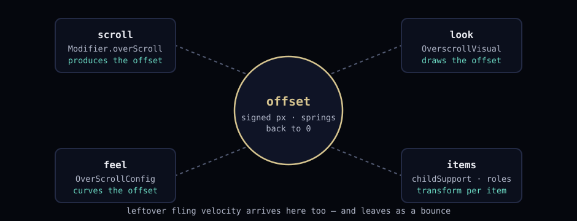

# Squishy

Overscroll effects for Jetpack Compose that you actually control.


[](https://jitpack.io/#/iamjosephmj/Squishy)


## What is overscroll?

Drag a list and your finger produces scroll delta. The content consumes what it
can — until you reach an edge. At the edge there is nothing left to scroll, but
your finger keeps demanding more. That leftover is **overscroll**.

Two gestures produce it:

- **Drag past the edge** — leftover *delta* every frame your finger moves
- **Fling into the edge** — leftover *velocity* once the content runs out of room

Stock Compose hands both to the platform stretch effect, and that's the end of
the story. You can't read it, shape it, or attach your own motion to it.

Squishy intercepts both leftovers and turns them into state you own: a signed
pixel offset that resists as it grows and springs back to zero when you let go.
Everything else in this library is a lens on that one number — where it renders,
how it curves, which items it moves.


## Install

```kotlin
repositories { maven { setUrl("https://jitpack.io") } }
```

```kotlin
dependencies { implementation("com.github.iamjosephmj:Squishy:2.1.1") }
```

## The pieces

One number, four lenses:



### 1. `OverScrollState` — the number, and who owns it

One state per scrolling screen. It carries the overscroll offset and the scroll
position, and it is the single source that every other piece reads from:

```kotlin
val state = rememberOverScrollState(
    config = OverScrollConfig(curve = OverscrollCurve.RubberBand()),
)
```

| Read | Meaning |
|---|---|
| `overscrollOffset` | Signed overscroll in px — positive at the top edge, negative at the bottom |
| `isOverscrolling` | True while an offset is held or settling |
| `scrollValue` / `maxScrollValue` | Where the content itself is scrolled |
| `maxOverscroll` | The configured limit |

`scrollTo` / `animateScrollTo` are there too, so programmatic scrolling uses the
same pipeline as gestures.

### 2. `Modifier.overScroll` — the scroll container

A plain `Column` doesn't scroll. This modifier makes the composable a scroll
container whose edges produce overscroll on `state`:

```kotlin
Column(Modifier.overScroll(state)) { /* rows */ }
```

Parameters, one by one:

- `state` — the state from step 1
- `containerEffect: Boolean = true` — whether the container itself renders the
  visual. `false` freezes the box and leaves the effect to the items (step 5)
- `enabled` — gate gestures without unwiring anything
- `flingBehavior` — any standard `FlingBehavior`, e.g.
  [Flinger](https://github.com/iamjosephmj/flinger)'s `FlingPresets.iOSStyle()`.
  Fling momentum flows through it; whatever it can't consume at the edge arrives
  in Squishy as bounce

### 3. `OverScrollArea` — containers you don't own

`LazyColumn`, `LazyRow`, grids and pagers bring their own scroll engine — you
can't hand them `overScroll`. Wrap them instead:

```kotlin
OverScrollArea(state, Modifier.fillMaxSize()) {
    LazyColumn(flingBehavior = FlingPresets.iOSStyle()) { /* items */ }
}
```

The area listens on the nested-scroll channel, takes the leftovers their engine
produces at the edges, feeds them to `state`, and silences the platform stretch
inside. Works with anything that participates in nested scroll.

### 4. `OverscrollVisual` — what the offset looks like

A visual is a pure function from the offset to a `Modifier` — nothing more:

```kotlin
val state = rememberOverScrollState(
    visual = OverscrollVisuals.zoom(minScaleX = 0.9f) + OverscrollVisuals.fade(),
)
```

Built-ins: `pushDown` (content follows the finger), `zoom`, `tilt`, `fade`,
`rotate`, `skew`, `blur` (API 31+; `minAlpha < 1f` degrades to fade below).
Stack with `+`. Write your own in three lines:

```kotlin
val wobble = OverscrollVisual { value, bounds, _ ->
    Modifier.graphicsLayer { rotationZ = value() / bounds * 20f }
}
```

### 5. Per-item — `childOverScrollSupport` and roles

Items can move while the container holds still (`containerEffect = false`).
Each item reads the same offset through a small scope:

```kotlin
Modifier.childOverScrollSupport(state) {
    translationY = value * 0.3f      // px, signed
    alpha = 1f - progress            // 0..1 of maxOverscroll
    // also: direction (Top/Bottom/None), index
}
```

Many items with distinct jobs? Register animations by name and tag the items —
the `setTag()` instinct from RecyclerView days:

```kotlin
val roles = rememberOverScrollRoles {
    transform("header") { translationY = value * 0.10f }
    transform("row") { translationY = value * (0.22f + index * 0.012f) }
}

Column(Modifier.overScroll(state, containerEffect = false)) {
    Text("Title", Modifier.overscrollRole(state, roles, "header"))
    items.forEachIndexed { i, item ->
        Text(item, Modifier.overscrollRole(state, roles, "row", index = i))
    }
}
```

`index` is the item's position, so one registered transform can stagger. Roles
can carry visuals too: `roles.visual("hero", OverscrollVisuals.tilt())`.
Unknown names do nothing — dynamic lists can't crash on stale tags.

### 6. `OverScrollConfig` — how the offset behaves

```kotlin
OverScrollConfig(
    maxOverscroll = 800f,                                  // the wall
    curve = OverscrollCurve.RubberBand(stiffness = 3f),    // resistance shape
    settleSpec = tween(500),                               // spring-home
    absorbVelocityFactor = 0.06f,                          // fling → bounce
    minAbsorbVelocity = 50f,                               // ignore ghosts
    topEdge = EdgeConfig(maxOverscroll = 300f),            // per-edge limits
    bottomEdge = EdgeConfig(enabled = false),              // pass-through
)
```

Curves map raw delta to offset growth: `Linear`, `RubberBand` (deeper pulls
cost more), or `Custom(rawDelta, current, max)`. A disabled edge lets its
delta continue to parent scrollables instead of eating it.

## Wiring it together

Every piece at once — a lazy feed with a header, tagged rows, a rubber band,
and a custom fling:

```kotlin
@Composable
fun Feed() {
    val state = rememberOverScrollState(                    // 1. the number
        config = OverScrollConfig(
            maxOverscroll = 600f,
            curve = OverscrollCurve.RubberBand(),
        ),
    )
    val roles = rememberOverScrollRoles {                   // 5. named layers
        transform("header") {
            translationY = value * 0.10f
            scaleY = 1f - progress * 0.08f
        }
        transform("row") { translationY = value * (0.20f + index * 0.01f) }
    }

    OverScrollArea(state, Modifier.fillMaxSize()) {         // 3. lazy support
        LazyColumn(flingBehavior = FlingPresets.iOSStyle()) {
            item {                                          // header rides too
                Text("Feed", Modifier.overscrollRole(state, roles, "header"))
            }
            items(posts) { post ->
                Post(post, Modifier.overscrollRole(state, roles, "row"))
            }
        }
    }
}
```

Drag the list mid-content: plain scrolling, Flinger momentum. Hit an edge: the
rubber band takes over — header lags, rows fan out by index. Let go: everything
springs home on `settleSpec`. Fling hard into the bottom: leftover velocity
becomes one bounce and settles.

## The demo app

The `app` module is documentation you can touch. Six chambers, each with live
overscroll telemetry (px, progress, scroll, status):

1. **Container** — the two-minute version, running
2. **Child mode** — box frozen, rows drifting
3. **Lazy column** — `OverScrollArea` around a real list
4. **Plugin playground** — swap all seven visuals live, mid-gesture
5. **Curves & edges** — tune the physics, apply, drag, repeat
6. **Tagged roles** — the registry pattern with a per-row depth readout

Clone, run, poke.

## Current limits

- One visual per container. Per-edge visuals are on the roadmap, not in the box.
- `blur()` renders real blur on API 31+ only.
- A state is vertical or horizontal — not both at once.

## v1 → v2

- `Modifier.overScroll(isParentOverScrollEnabled, overscrollEffect, orientation, flingBehavior)`
  → `Modifier.overScroll(state)`
- `childOverScrollSupport(overscrollEffect)` → `childOverScrollSupport(state)`
- `rememberPushDownOverscrollEffect(...)` still exists; prefer `rememberOverScrollState(...)`

## Contributing

PRs against the default branch. `./gradlew squishy:test app:lint` should pass and
the lint analyzer should stay quiet. Internally: `physics` / `scroll` / `visual` /
`child` / `state` packages, one concern per file.

## License

MIT — see [LICENSE](LICENSE).
